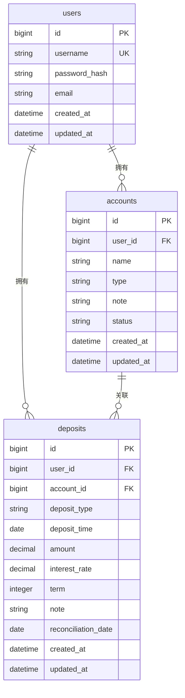

# 数据库设计文档

## 1. 数据库概述

- **数据库类型**：SQLite
- **字符编码**：UTF-8
- **命名规范**：表名和字段名使用小写+下划线（snake_case）

## 2. ER图



## 3. 表结构设计

### 3.1 users（用户表）

| 字段名 | 类型 | 约束 | 说明 |
|--------|------|------|------|
| id | BIGINT | PRIMARY KEY, AUTO_INCREMENT | 用户ID |
| username | VARCHAR(50) | UNIQUE, NOT NULL | 用户名 |
| password_hash | VARCHAR(255) | NOT NULL | 密码哈希（BCrypt） |
| email | VARCHAR(100) | NULL | 邮箱（可选） |
| created_at | DATETIME | NOT NULL, DEFAULT CURRENT_TIMESTAMP | 创建时间 |
| updated_at | DATETIME | NOT NULL, DEFAULT CURRENT_TIMESTAMP | 更新时间 |

**索引**：
- PRIMARY KEY (id)
- UNIQUE INDEX idx_username (username)

**SQL创建语句**：
```sql
CREATE TABLE users (
    id BIGINT PRIMARY KEY AUTOINCREMENT,
    username VARCHAR(50) NOT NULL UNIQUE,
    password_hash VARCHAR(255) NOT NULL,
    email VARCHAR(100),
    created_at DATETIME NOT NULL DEFAULT CURRENT_TIMESTAMP,
    updated_at DATETIME NOT NULL DEFAULT CURRENT_TIMESTAMP
);

CREATE INDEX idx_users_username ON users(username);
```

### 3.2 accounts（账户表）

| 字段名 | 类型 | 约束 | 说明 |
|--------|------|------|------|
| id | BIGINT | PRIMARY KEY, AUTO_INCREMENT | 账户ID |
| user_id | BIGINT | FOREIGN KEY, NOT NULL | 用户ID |
| name | VARCHAR(100) | NOT NULL | 账户名称 |
| type | VARCHAR(20) | NOT NULL | 账户类型（银行、支付宝、微信、理财APP、股票） |
| note | TEXT | NULL | 备注 |
| status | VARCHAR(20) | NOT NULL, DEFAULT 'ACTIVE' | 状态（ACTIVE-启用, DISABLED-停用） |
| created_at | DATETIME | NOT NULL, DEFAULT CURRENT_TIMESTAMP | 创建时间 |
| updated_at | DATETIME | NOT NULL, DEFAULT CURRENT_TIMESTAMP | 更新时间 |

**索引**：
- PRIMARY KEY (id)
- INDEX idx_user_id (user_id)
- INDEX idx_user_status (user_id, status)

**SQL创建语句**：
```sql
CREATE TABLE accounts (
    id BIGINT PRIMARY KEY AUTOINCREMENT,
    user_id BIGINT NOT NULL,
    name VARCHAR(100) NOT NULL,
    type VARCHAR(20) NOT NULL,
    note TEXT,
    status VARCHAR(20) NOT NULL DEFAULT 'ACTIVE',
    created_at DATETIME NOT NULL DEFAULT CURRENT_TIMESTAMP,
    updated_at DATETIME NOT NULL DEFAULT CURRENT_TIMESTAMP,
    FOREIGN KEY (user_id) REFERENCES users(id) ON DELETE CASCADE
);

CREATE INDEX idx_accounts_user_id ON accounts(user_id);
CREATE INDEX idx_accounts_user_status ON accounts(user_id, status);
```

### 3.3 deposits（存款记录表）

| 字段名 | 类型 | 约束 | 说明 |
|--------|------|------|------|
| id | BIGINT | PRIMARY KEY, AUTO_INCREMENT | 存款记录ID |
| user_id | BIGINT | FOREIGN KEY, NOT NULL | 用户ID |
| account_id | BIGINT | FOREIGN KEY, NOT NULL | 账户ID |
| deposit_type | VARCHAR(50) | NOT NULL | 存款类型（活期、定期、理财、其他） |
| deposit_time | DATE | NOT NULL | 存款时间 |
| amount | DECIMAL(15,2) | NOT NULL | 金额 |
| interest_rate | DECIMAL(5,2) | NULL | 利率（百分比，如2.5表示2.5%） |
| term | INTEGER | NULL | 存期（年数，仅定期存款使用，范围1-10年） |
| note | TEXT | NULL | 备注 |
| reconciliation_date | DATE | NOT NULL | 对账日期（该记录属于哪个日期的快照） |
| created_at | DATETIME | NOT NULL, DEFAULT CURRENT_TIMESTAMP | 创建时间 |
| updated_at | DATETIME | NOT NULL, DEFAULT CURRENT_TIMESTAMP | 更新时间 |

**索引**：
- PRIMARY KEY (id)
- INDEX idx_user_reconciliation (user_id, reconciliation_date)
- INDEX idx_account_reconciliation (account_id, reconciliation_date)
- INDEX idx_user_account_reconciliation (user_id, account_id, reconciliation_date)
- INDEX idx_reconciliation_date (reconciliation_date)

**约束说明**：
- `reconciliation_date >= deposit_time`（应用层校验，数据库层不强制）

**SQL创建语句**：
```sql
CREATE TABLE deposits (
    id BIGINT PRIMARY KEY AUTOINCREMENT,
    user_id BIGINT NOT NULL,
    account_id BIGINT NOT NULL,
    deposit_type VARCHAR(50) NOT NULL,
    deposit_time DATE NOT NULL,
    amount DECIMAL(15,2) NOT NULL,
    interest_rate DECIMAL(5,2),
    term INTEGER,
    note TEXT,
    reconciliation_date DATE NOT NULL,
    created_at DATETIME NOT NULL DEFAULT CURRENT_TIMESTAMP,
    updated_at DATETIME NOT NULL DEFAULT CURRENT_TIMESTAMP,
    FOREIGN KEY (user_id) REFERENCES users(id) ON DELETE CASCADE,
    FOREIGN KEY (account_id) REFERENCES accounts(id)
);

CREATE INDEX idx_deposits_user_reconciliation ON deposits(user_id, reconciliation_date);
CREATE INDEX idx_deposits_account_reconciliation ON deposits(account_id, reconciliation_date);
CREATE INDEX idx_deposits_user_account_reconciliation ON deposits(user_id, account_id, reconciliation_date);
CREATE INDEX idx_deposits_reconciliation_date ON deposits(reconciliation_date);
```

## 4. 关键查询场景

### 4.1 获取最近一次对账日期
```sql
SELECT MAX(reconciliation_date) 
FROM deposits 
WHERE user_id = ?;
```

### 4.2 复制历史对账数据（查询最近一次对账的所有存款记录）
```sql
SELECT * 
FROM deposits 
WHERE user_id = ? 
  AND reconciliation_date = (
      SELECT MAX(reconciliation_date) 
      FROM deposits 
      WHERE user_id = ?
  )
ORDER BY account_id, deposit_time;
```

### 4.3 获取指定日期的对账数据（按账户分组）
```sql
SELECT 
    d.*,
    a.name AS account_name,
    a.type AS account_type
FROM deposits d
INNER JOIN accounts a ON d.account_id = a.id
WHERE d.user_id = ? 
  AND d.reconciliation_date = ?
ORDER BY a.id, d.deposit_time;
```

### 4.4 按月统计（获取某月最后一次对账日期）
```sql
-- 第一步：找到该月最后一次对账日期
SELECT MAX(reconciliation_date) 
FROM deposits 
WHERE user_id = ? 
  AND strftime('%Y-%m', reconciliation_date) = ?;

-- 第二步：如果该月无记录，向前查找最近月份
SELECT MAX(reconciliation_date) 
FROM deposits 
WHERE user_id = ? 
  AND reconciliation_date < ? || '-01';

-- 第三步：统计该日期的存款总额和分布
SELECT 
    a.id AS account_id,
    a.name AS account_name,
    SUM(d.amount) AS total_amount
FROM deposits d
INNER JOIN accounts a ON d.account_id = a.id
WHERE d.user_id = ? 
  AND d.reconciliation_date = ?
GROUP BY a.id, a.name;
```

### 4.5 多个月趋势统计
```sql
-- 获取每个月的最后一次对账日期和总额
WITH monthly_last_reconciliation AS (
    SELECT 
        user_id,
        strftime('%Y-%m', reconciliation_date) AS month,
        MAX(reconciliation_date) AS last_date
    FROM deposits
    WHERE user_id = ?
      AND reconciliation_date >= ?  -- 起始日期
    GROUP BY user_id, month
)
SELECT 
    mlr.month,
    COALESCE(SUM(d.amount), 0) AS total_amount
FROM monthly_last_reconciliation mlr
LEFT JOIN deposits d ON d.user_id = mlr.user_id 
    AND d.reconciliation_date = mlr.last_date
GROUP BY mlr.month
ORDER BY mlr.month;
```

## 5. 数据迁移策略

### 5.1 初始化脚本
创建 `db/migration/V1__init_schema.sql` 文件，包含所有表的创建语句。

### 5.2 数据约束
- 删除用户时，级联删除该用户的所有账户和存款记录（ON DELETE CASCADE）
- 删除账户时，不删除关联的存款记录（保留历史数据），但账户状态改为DISABLED
- 应用层需要校验：`reconciliation_date >= deposit_time`

## 6. 性能优化建议

1. **索引优化**：
   - `deposits` 表的 `(user_id, reconciliation_date)` 组合索引用于快速查询对账数据
   - `deposits` 表的 `(user_id, account_id, reconciliation_date)` 组合索引用于账户维度的查询

2. **查询优化**：
   - 统计查询时使用聚合函数，避免在应用层计算
   - 按月统计时，先找到最后一次对账日期，再查询该日期的数据，避免全表扫描

3. **数据量预估**：
   - 假设每个用户每月1次对账，每次对账10个账户，每个账户5条存款记录
   - 1年数据量：1用户 × 12月 × 10账户 × 5记录 = 600条
   - 10年数据量：6000条/用户
   - SQLite 可以轻松支持单表百万级数据，性能足够
